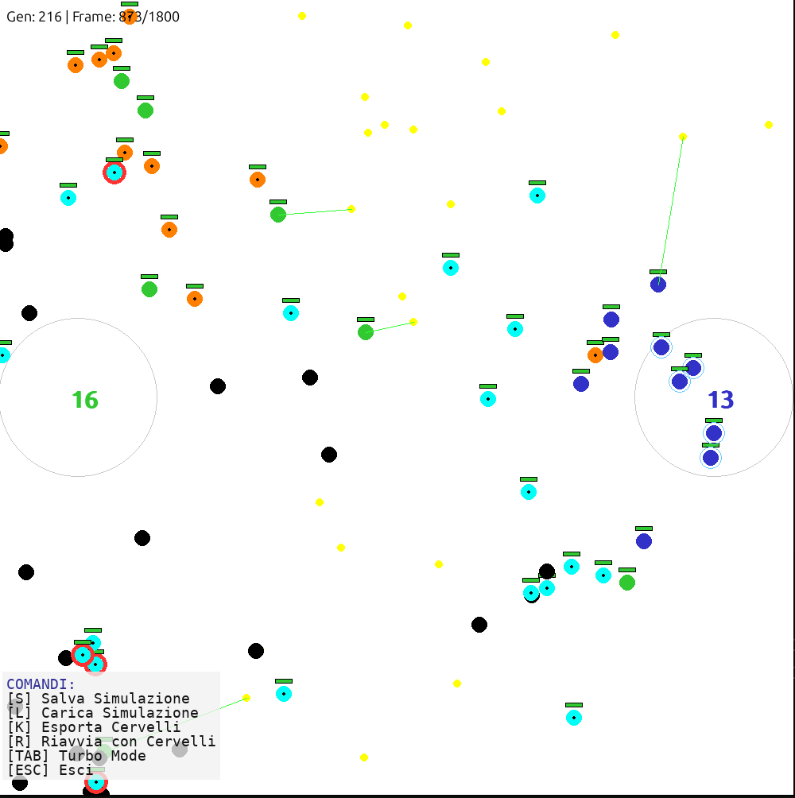

# Evolutionary Agent Simulation

A Python-based simulation environment exploring **Co-Evolutionary Neural Networks** using **pygame** and **numpy**. This project simulates two competing teams of autonomous agents (Green vs. Blue) that evolve over generations to optimize resource gathering, base defense, and combat strategies using a genetic algorithm.

## Project Overview

The simulation operates on a closed loop where agents act based on sensory inputs processed by a Feed-Forward Neural Network.

* **Goal:** Agents must gather resources and deposit them at their base while defending against the opposing team.
* **Evolution:** At the end of each epoch, the population is evaluated based on a fitness function. The best "brains" are selected for crossover and mutation.
* **Architecture:** Zero-dependency Neural Network implementation (NumPy only).



## Installation

Follow these steps to set up the environment locally.

### 1. Prerequisites
* Python 3.8 or higher
* **pip** (Python Package Installer)
* Git

### 2. Clone the Repository
```bash
git clone https://github.com/mat-riboni/evolutionary-agents-simulation
cd <YOUR_REPOSITORY_FOLDER>
```

### 3. Set up a Virtual Environment (Recommended)
It is best practice to run the simulation in an isolated virtual environment to avoid conflicting dependencies.

**Windows:**

```bash
python -m venv venv
.\venv\Scripts\activate
```

**macOS / Linux:**

```bash
python3 -m venv venv
source venv/bin/activate
```

### 4. Install Dependencies
Install the required packages using the provided **requirements.txt**:

```bash
pip install -r requirements.txt
```

## Usage

### Running the Simulation
Ensure your virtual environment is active, then execute the main simulation script:

```bash
python simulation.py
```

### Controls & Interface
The simulation runs in real-time (60 FPS default). The window must be focused to receive input commands.

| Key | Function | Description |
| :--- | :--- | :--- |
| **TAB** | **Turbo Mode** | Toggles between real-time rendering and maximum logical speed (no render delay) for faster training. |
| **S** | **Save State** | Serializes the current simulation state (agents, generation, weights) to **checkpoint.pkl**. |
| **L** | **Load State** | Deserializes and restores the simulation from **checkpoint.pkl**. |
| **K** | **Export Brains** | Exports just the neural weights of the current population. |
| **ESC** | **Exit** | Terminates the application. |

## Configuration

The simulation parameters can be adjusted in **settings.py**. Key configuration groups include:

* **Population & Physics:** **NUM_AGENTS**, **MAX_SPEED_LIMIT**, **FOV_RADIUS**.
* **Neural Network:** **HIDDEN_SIZE** (Neurons in hidden layers), **INPUT_SIZE**.
* **Evolution:** **MUTATION_RATE**, **ELITISM_RATE**, **EPOCH_DURATION**.
* **Rewards:** Weights for **DEPOSIT_REWARD**, **KILL_REWARD**, **DEATH_PENALTY**.

## Technical Architecture

### Neural Network (brain.py)
* **Type:** Fully Connected Feed-Forward (MLP).
* **Topology:** Input Layer (17) -> Hidden Layer 1 (24) -> Hidden Layer 2 (24) -> Output Layer (3).
* **Activation:** Hyperbolic Tangent (**tanh**) for normalized outputs between -1 and 1.
* **Outputs:** Thrust (Velocity), Turn (Angle), Attack (Trigger).

### Genetic Algorithm (genetics.py)
* **Selection:** Tournament Selection (Size: 3).
* **Crossover:** Arithmetic Crossover (Weighted average of parent matrices).
* **Mutation:**
    * *Fine Tuning:* High probability, low variance noise.
    * *Structural Shock:* Low probability, high variance noise (to escape local minima).

## Project Structure

```text
.
├── agent.py           # Agent entity logic (physics, sensors, metabolism)
├── brain.py           # Matrix-based Neural Network implementation
|── genetics.py        # Evolutionary logic (Selection, Crossover, Mutation)
├── resource.py        # Resource entity definition
├── settings.py        # Global constants and hyperparameters
├── simulation.py      # Main entry point, render loop, and state manager
├── requirements.txt   # Project dependencies
└── README.md          # Documentation
```

## Notes

* **Save Compatibility:** **pickle** files are sensitive to class structure changes. If you modify **Agent** or **Brain** classes, previous save files (**checkpoint.pkl**) may become incompatible.